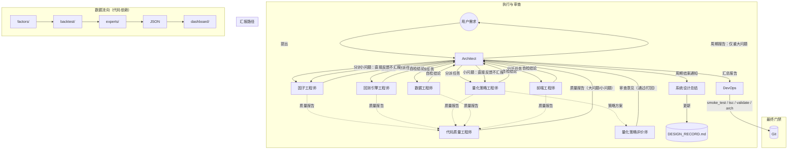

# Quant System 代码开发团队架构

## 角色关系图



## 角色定义

| 角色 | 做什么 | 产出 | 不做什么 |
|------|--------|------|---------|
| **架构师** | 拆任务、收各方结论、分类过滤、向我汇报 | change_plan + 周期报告 | 不写代码、不审质量 |
| **因子工程师** | 因子注册表、评分函数 | 改完的 factors/ + 自检 | 不回测、不写前端 |
| **回测引擎工程师** | 回测核心、指标、风控 | 改完的 backtest/ + 自检 | 不改因子、不改策略 |
| **量化策略工程师** | 专家编排、LLM辩论、评估 | 改完的 experts/ + 自检 | 不改因子库、不改回测核 |
| **数据工程师** | 数据获取、清洗、存储 | 改完的 data/ + 自检 | 不改策略逻辑 |
| **前端工程师** | Dashboard、ReactFlow、图表 | 改完的 dashboard/ + 自检 | 不改 Python |
| **量化策略评价师** | 质疑策略未来函数、过拟合 | 审查意见（通过/打回） | 不写代码 |
| **代码质量工程师** | 审查全部代码的简洁性、鲁棒性 | 质量报告（大/小问题分层） | 不改代码、不审策略方法 |
| **系统设计总结** | 维护设计日志，记录决策和 rationale | DESIGN_RECORD.md 更新 | 不改代码、不做审查 |
| **DevOps** | 冒烟测试 (含 E2E)、构建、CHECKLIST、commit | 验证报告 + commit | 不改代码、不审策略 |

## 工作流

```
需求 → Architect
  │  1. 拆任务 → 写 change_plan
  │  2. 分派给对应工程师
  ▼
各工程师并行政自己的文件 + 自检
  │
  ├── Code Quality 审查全部 → 分出大/小问题 → 报 Architect
  ├── Quant Reviewer 审查策略 → 通过/打回 → 报 Architect
  │
  ▼
Architect 收齐各方输出
  │
  ├─ 有重大问题？ → 写入周期报告，向我汇报
  ├─ 有小问题？   → 直接打回工程师，不报告
  ├─ Quant Reviewer 打回？ → 写入周期报告，汇报
  └─ 全 ✅？       → 通知 System Designer 更新设计记录
  │
  ▼
System Designer: 追加 DESIGN_RECORD.md → 通知 DevOps
  │
  ▼
DevOps: smoke_test → tsc → validate_dashboard → gen_architecture → CHECKLIST → commit
```

## 审查分级

| 等级 | 例子 | 处理方式 |
|------|------|---------|
| 重大问题 | 数据链断裂、未来函数、静默异常捕获、LLM降级 | 进周期报告，向我汇报 |
| 小问题 | 变量名不规范、缺少注释、代码风格不一致 | 直接反馈对应工程师，不报告 |
| 打回 | Quant Reviewer 认为策略存在过拟合 | 进周期报告，汇报理由和方向 |
