# Quant Multi-Expert Trading System — Architecture

## System Overview

```mermaid
graph TB
    %% ── Entry Points ──
    subgraph ENTRY["🚀 Entry Points"]
        EP1["scripts/run_pipeline.py<br/>(main entry)"]
        EP2["scripts/run_backtest.py"]
        EP3["scripts/run_multi_expert.py"]
    end

    %% ── Data Layer ──
    subgraph DATA["📦 Layer 1: Data"]
        DC1["scripts/collectors/stooq_collector.py<br/>Stooq (US/crypto/A股)"]
        DC2["scripts/collectors/astock_minute_collector.py<br/>A股 minute bars"]
        DL["backtest/local_data.py<br/>Load cached JSON → OHLCV"]
        DF["experts/modules/data_fetcher.py<br/>Stooq / Brownian fallback"]
        RAW["data/raw/*.json<br/>Cached price data"]
        DC1 --> RAW
        DC2 --> RAW
        RAW --> DL
        DF --> RAW
    end

    %% ── Factor Library ──
    subgraph FACTORS["📐 Layer 2: Factor Library (factors/)"]
        FA["base_operators.py<br/>SMA EMA RSI MACD ATR BBands…"]
        FB["trend.py<br/>Ichimoku SAR KST Donchian Aroon"]
        FC["mean_reversion.py<br/>MFI RVI KDWave OBOS"]
        FD["momentum.py<br/>ForceIndex ElderRay PPO"]
        FE["volume.py<br/>ADLine VPT MassIndex"]
        FF["volatility.py<br/>UltraSpline UltraBand"]
        FG["chanlun.py<br/>缠论 Bi/Tao"]
        FH["composite.py<br/>Combined indicators"]
        FI["signals.py<br/>FACTOR_TABLE (47 factors F00-F47)<br/>generate_signal()"]
        FA & FB & FC & FD & FE & FF & FG & FH --> FI
    end

    %% ── Strategy Layer ──
    subgraph STRATS["📋 Layer 3: Strategy Library (strategies/ + experts/specialists/)"]
        S1["specialists/expert1a_trend.py<br/>TrendExpert<br/>MA Cross / MACD / Momentum / ADX"]
        S2["specialists/expert1b_mean_reversion.py<br/>MeanReversionExpert<br/>RSI / Bollinger / VolumeSurge"]
        S3["strategies/xb_tier1_binance.py<br/>8× Binance strategies (T1-01~T1-08)"]
        S4["strategies/xb_tier2_ashare.py<br/>A股 strategies"]
        SO["strategies/param_optimizer.py<br/>Grid search"]
        SR["strategies/regime_engine.py<br/>Regime-aware execution"]
    end

    %% ── Backtest Layer ──
    subgraph BACKTEST["⚙️ Layer 4: Backtesting"]
        BE["backtest/vectorbt_engine.py<br/>Pandas + vectorbt v0.28.4<br/>6 signal generators"]
        BR["backtest/runner.py<br/>Full backtest pipeline"]
        RF["experts/realistic_friction.py<br/>Commission + slippage + stamp duty"]
        WF["experts/modules/walk_forward.py<br/>Walk-forward analysis"]
        PBO["experts/modules/pbo_analysis.py<br/>Overfitting detection"]
        BE --> RF
        BR --> BE
        BR --> WF
        BR --> PBO
    end

    %% ── Expert Systems ──
    subgraph EXPERTS["🤖 Layer 5: Expert Orchestration (experts/)"]
        ORC["orchestrator.py v4.0<br/>3-round iteration loop"]

        subgraph ROUND["Per-Round Pipeline"]
            GEN["expert1_generator.py<br/>Candidate generation"]
            EVA["evaluator.py (Expert2)<br/>40% Sharpe + 30% DD + 30% Return<br/>Hard filters + PBO check"]
            DEB["debate_manager.py<br/>4-agent adversarial debate<br/>Trend vs MR / Bull vs Bear"]
            FB2["structured_feedback.py<br/>Weakness + AdjustmentDirection"]
        end

        RISK["modules/risk_engine.py<br/>VaR / CVaR / Stress Test"]
        REG["modules/regime.py + regime_detector.py<br/>STRONG_TREND / SIDEWAYS / CRISIS"]
        LLM["modules/llm_proxy.py<br/>MaxClaw LLM strategy generation"]
        NEWS["modules/news_sentiment.py<br/>Sentiment analysis"]
        META["meta_monitor.py<br/>Execution monitoring"]

        ORC --> GEN --> EVA --> DEB --> FB2
        FB2 -->|"next round params"| GEN
        ORC --> RISK
        ORC --> REG
        ORC --> LLM
    end

    %% ── Dashboard ──
    subgraph DASH["🖥️ Layer 6: Dashboard (dashboard/)"]
        APP["src/App.tsx<br/>React 18 + TypeScript + Vite"]
        V1["views/BacktestView.tsx"]
        V2["views/ExpertView.tsx"]
        V3["views/FactorView.tsx"]
        V4["views/StrategyView.tsx"]
        V5["views/DataSourceView.tsx"]
        APP --> V1 & V2 & V3 & V4 & V5
        DEPLOY["GitHub Pages<br/>(dashboard/.github/workflows/)"]
        APP --> DEPLOY
    end

    %% ── Config ──
    subgraph CFG["⚙️ Config"]
        C1["config/settings.py<br/>Capital ¥1M / Risk limits / Broker"]
        C2["config/markets.py<br/>Trading hours / Symbols / Fees"]
    end

    %% ── Monitoring ──
    MON["monitoring/logger.py<br/>Structured JSON logging"]

    %% ── Main Data Flow ──
    EP1 --> DL
    EP1 --> ORC
    DL --> ORC
    FI --> S1 & S2
    S1 & S2 --> GEN
    GEN --> BE
    BE --> EVA
    ORC -->|"results JSON"| DASH
    ORC --> MON
    CFG --> ORC
    CFG --> BE

    %% Styling
    classDef entry fill:#4CAF50,color:#fff,stroke:#388E3C
    classDef data fill:#2196F3,color:#fff,stroke:#1565C0
    classDef factor fill:#9C27B0,color:#fff,stroke:#6A1B9A
    classDef strat fill:#FF9800,color:#fff,stroke:#E65100
    classDef backtest fill:#F44336,color:#fff,stroke:#B71C1C
    classDef expert fill:#00BCD4,color:#fff,stroke:#006064
    classDef dash fill:#607D8B,color:#fff,stroke:#263238
    classDef config fill:#795548,color:#fff,stroke:#3E2723

    class EP1,EP2,EP3 entry
    class DC1,DC2,DL,DF,RAW data
    class FA,FB,FC,FD,FE,FF,FG,FH,FI factor
    class S1,S2,S3,S4,SO,SR strat
    class BE,BR,RF,WF,PBO backtest
    class ORC,GEN,EVA,DEB,FB2,RISK,REG,LLM,NEWS,META expert
    class APP,V1,V2,V3,V4,V5,DEPLOY dash
    class C1,C2 config
```



---

## Directory Map

```
/home/readm/quant/
│
├── config/                     ⚙️  Global config (capital, risk, markets)
│   ├── settings.py
│   └── markets.py
│
├── factors/                    📐  47-factor library (pure NumPy)
│   ├── __init__.py             (80+ exports)
│   ├── base_operators.py       (13 core indicators)
│   ├── trend.py                (Ichimoku, SAR, Donchian…)
│   ├── mean_reversion.py       (MFI, RVI, KDWave…)
│   ├── momentum.py
│   ├── volume.py
│   ├── volatility.py
│   ├── chanlun.py              (缠论 Bi/Tao)
│   ├── composite.py
│   └── signals.py              ← FACTOR_TABLE F00-F47 + generate_signal()
│
├── experts/                    🤖  Expert orchestration engine
│   ├── orchestrator.py         ← v4.0 main loop (3 rounds)
│   ├── expert1_generator.py
│   ├── evaluator.py            (Expert2: scoring + PBO)
│   ├── debate_manager.py       (4-agent adversarial debate)
│   ├── structured_feedback.py
│   ├── regime_detector.py
│   ├── realistic_friction.py
│   ├── meta_monitor.py
│   ├── specialists/
│   │   ├── expert1a_trend.py       (TrendExpert)
│   │   ├── expert1b_mean_reversion.py (MeanReversionExpert)
│   │   ├── bear_researcher.py
│   │   ├── expert3_surveyor.py
│   │   └── expert4_dataset_specialist.py
│   └── modules/
│       ├── risk_engine.py      (VaR, CVaR, stress test)
│       ├── regime.py
│       ├── llm_proxy.py        (MaxClaw LLM integration)
│       ├── data_fetcher.py     (Stooq + GBM fallback)
│       ├── news_sentiment.py
│       ├── pbo_analysis.py
│       ├── walk_forward.py
│       └── alpha158.py         (QLib factor set)
│
├── strategies/                 📋  Strategy templates & optimizers
│   ├── backtest_engine.py
│   ├── param_optimizer.py
│   ├── regime_engine.py
│   ├── xb_tier1_binance.py     (8 Binance strategies)
│   └── xb_tier2_ashare.py      (A股 strategies)
│
├── backtest/                   ⚙️  Backtesting engines
│   ├── local_data.py           (load cached JSON → OHLCV)
│   ├── runner.py
│   └── vectorbt_engine.py      (6 signal generators)
│
├── scripts/                    🚀  Pipeline & data collection
│   ├── run_pipeline.py         ← MAIN ENTRY POINT
│   ├── run_backtest.py
│   ├── run_multi_expert.py
│   ├── build_dashboard.py
│   └── collectors/
│       ├── stooq_collector.py
│       └── astock_minute_collector.py
│
├── monitoring/                 📊  Logging
│   └── logger.py
│
├── dashboard/                  🖥️  React 18 frontend
│   ├── src/
│   │   ├── App.tsx
│   │   └── views/              (5 pages)
│   ├── dist/                   (built output)
│   └── .github/workflows/      (GitHub Pages CI)
│
└── [root legacy files]         (multi_expert_v3.py etc.)
```

---

## Expert Pipeline Detail (Per Round)

```
Orchestrator.run()
│
├─ Load OHLCV data (backtest/local_data.py)
│
├─ [Round 1~3]
│   │
│   ├─ TrendExpert.generate_candidates()      → BacktestReport[]
│   │   └─ 4 templates × param grid → simulate() → metrics
│   │
│   ├─ MeanReversionExpert.generate_candidates() → BacktestReport[]
│   │   └─ 3 templates × param grid → simulate() → metrics
│   │
│   ├─ Evaluator.evaluate_batch()             → EvalResult[]
│   │   ├─ Hard filter (min Sharpe, max DD)
│   │   ├─ Score = 40%×Sharpe + 30%×(1-DD) + 30%×Return
│   │   └─ PBO overfitting check
│   │
│   ├─ DebateManager.conduct_debate()         → DebateResult
│   │   ├─ TrendExpert analysis
│   │   ├─ MeanReversionExpert analysis
│   │   ├─ BullResearcher (bull case)
│   │   └─ BearResearcher (risk/bear case)
│   │       → trend_weight / mr_weight / confidence
│   │
│   └─ StructuredFeedback → params for next round
│       ├─ Weakness: LOW_SHARPE / HIGH_DRAWDOWN / OVERFITTED…
│       └─ AdjustmentDirection: INCREASE_LOOKBACK / TIGHTEN_STOP…
│
└─ Final: Top 3-4 strategies + git commit
```

---

## Data Flows

| Flow | Path |
|------|------|
| Raw price data | `collectors/` → `data/raw/*.json` → `backtest/local_data.py` |
| Factor signals | `factors/signals.py generate_signal()` → strategy candidates |
| Strategy evaluation | `experts/specialists/` → `backtest/vectorbt_engine.py` → `experts/evaluator.py` |
| Regime context | `experts/modules/regime.py` → `orchestrator.py` |
| Risk overlay | `experts/modules/risk_engine.py` → `orchestrator.py` |
| LLM generation | `experts/modules/llm_proxy.py` → `expert1_generator.py` |
| Results output | `orchestrator.py` → JSON → `dashboard/src/` |
| Frontend deploy | `dashboard/` → GitHub Pages |
